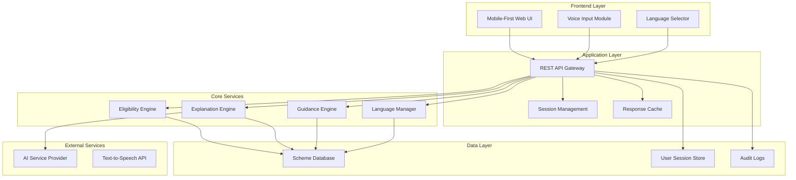

# Design Document: AI-Powered Government Scheme Eligibility & Explainer System

## Overview

The AI-Powered Government Scheme Eligibility & Explainer System is designed as a citizen-centric web application that democratizes access to government benefits through transparent, rule-based eligibility matching and AI-powered plain-language explanations. The system architecture prioritizes trust, accessibility, and performance while maintaining strict separation between rule-based eligibility decisions and AI-powered content simplification.

The system serves as a bridge between complex government bureaucracy and citizen needs, transforming technical eligibility criteria into understandable guidance while ensuring all decisions remain transparent and auditable. The design emphasizes mobile-first accessibility, low-bandwidth optimization, and multi-language support to reach India's diverse digital landscape.

## Architecture

The system follows a modular, service-oriented architecture with clear separation of concerns:



### Architectural Principles

1. **Separation of Concerns**: Eligibility decisions are completely isolated from AI processing
2. **Fail-Safe Design**: System degrades gracefully when AI services are unavailable
3. **Audit Trail**: All decisions and AI interactions are logged for transparency
4. **Performance First**: Optimized for 3G networks and basic smartphones
5. **Stateless Services**: Core services can scale horizontally without session dependencies

## Components and Interfaces

### Eligibility Engine

The Eligibility Engine is the core rule-based component responsible for matching user profiles against scheme criteria.

**Interface:**
```typescript
interface EligibilityEngine {
  evaluateEligibility(userProfile: UserProfile): EligibilityResult[];
  getSchemeDetails(schemeId: string): SchemeDetails;
  validateUserProfile(profile: UserProfile): ValidationResult;
}

interface EligibilityResult {
  schemeId: string;
  schemeName: string;
  confidenceScore: number; // 0-100
  matchedCriteria: string[];
  missingCriteria: string[];
  exclusionReasons: string[];
}
```

**Core Responsibilities:**
- Apply predefined eligibility rules without AI involvement
- Calculate confidence scores based on criteria matching
- Handle state-specific and category-based rules
- Provide transparent reasoning for all decisions

### Explanation Engine

The Explanation Engine uses AI to convert complex government language into plain-language explanations while ensuring all content remains grounded in source material.

**Interface:**
```typescript
interface ExplanationEngine {
  simplifySchemeDescription(scheme: SchemeDetails, language: string): SimplifiedScheme;
  explainEligibilityCriteria(criteria: string[], language: string): string[];
  generateBenefitSummary(benefits: string[], language: string): string;
  fallbackToTemplate(schemeId: string, language: string): SimplifiedScheme;
}

interface SimplifiedScheme {
  whatItIs: string;
  whoGetsIt: string;
  benefits: string;
  whoShouldNotApply: string;
  isAIGenerated: boolean;
}
```

**Core Responsibilities:**
- Simplify content to Class-6 reading level
- Maintain grounding in original scheme documentation
- Provide fallback templates when AI fails
- Support multiple languages with cultural context

### Guidance Engine

The Guidance Engine provides structured, step-by-step application guidance with document checklists and timeline information.

**Interface:**
```typescript
interface GuidanceEngine {
  generateApplicationFlow(schemeId: string): ApplicationFlow;
  getDocumentChecklist(schemeId: string): DocumentRequirement[];
  getCommonMistakes(schemeId: string): string[];
  getTimeline(schemeId: string): ApplicationTimeline;
}

interface ApplicationFlow {
  stages: ApplicationStage[];
  totalEstimatedTime: string;
  criticalDeadlines: Date[];
}

interface ApplicationStage {
  name: string;
  description: string;
  steps: string[];
  requiredDocuments: string[];
  estimatedTime: string;
  commonMistakes: string[];
}
```

**Core Responsibilities:**
- Structure application processes into digestible stages
- Provide comprehensive document checklists
- Highlight common pitfalls and mistakes
- Offer realistic timeline expectations

### Language Manager

The Language Manager handles multi-language support, translation caching, and cultural adaptation of content.

**Interface:**
```typescript
interface LanguageManager {
  translateContent(content: string, targetLanguage: string): string;
  getAvailableLanguages(): Language[];
  validateTranslation(original: string, translated: string): boolean;
  getCulturalContext(language: string): CulturalContext;
}

interface Language {
  code: string;
  name: string;
  nativeName: string;
  isSupported: boolean;
  readingLevel: string;
}
```

## Data Models

### User Profile Model

```typescript
interface UserProfile {
  sessionId: string;
  demographics: {
    age: number;
    state: string;
    district?: string;
    gender: 'male' | 'female' | 'other';
    category: 'general' | 'obc' | 'sc' | 'st' | 'ews';
  };
  socioeconomic: {
    incomeRange: 'below-1lakh' | '1-3lakh' | '3-5lakh' | '5-8lakh' | 'above-8lakh';
    occupation: string;
    educationLevel: 'illiterate' | 'primary' | 'secondary' | 'graduate' | 'postgraduate';
    employmentStatus: 'unemployed' | 'employed' | 'self-employed' | 'student' | 'retired';
  };
  preferences: {
    language: string;
    voiceEnabled: boolean;
    lowBandwidthMode: boolean;
  };
  timestamp: Date;
}
```

### Scheme Data Model

```typescript
interface SchemeDetails {
  id: string;
  name: string;
  description: string;
  category: 'education' | 'health' | 'employment' | 'housing' | 'agriculture' | 'social-security';
  launchingAuthority: 'central' | 'state' | 'district';
  
  eligibility: {
    mandatory: EligibilityCriterion[];
    optional: EligibilityCriterion[];
    exclusions: EligibilityCriterion[];
  };
  
  benefits: {
    type: 'financial' | 'subsidy' | 'service' | 'certificate';
    amount?: number;
    description: string;
    frequency?: 'one-time' | 'monthly' | 'yearly';
  };
  
  application: {
    process: ApplicationProcess;
    documents: DocumentRequirement[];
    deadlines: string[];
    processingTime: string;
  };
  
  metadata: {
    lastUpdated: Date;
    version: string;
    sourceUrl: string;
    verificationStatus: 'verified' | 'pending' | 'outdated';
  };
}

interface EligibilityCriterion {
  field: string;
  operator: 'equals' | 'greater_than' | 'less_than' | 'in_range' | 'contains';
  value: any;
  weight: number; // For confidence scoring
  description: string;
}
```

### Response Models

```typescript
interface EligibilityResponse {
  matchedSchemes: EligibilityResult[];
  totalSchemes: number;
  processingTime: number;
  recommendations: string[];
  nextSteps: string[];
}

interface SchemeExplanation {
  schemeId: string;
  simplified: SimplifiedScheme;
  originalCriteria: string[];
  simplifiedCriteria: string[];
  confidenceFactors: string[];
  applicationGuidance: ApplicationFlow;
  language: string;
  generatedAt: Date;
}
```

## Correctness Properties

*A property is a characteristic or behavior that should hold true across all valid executions of a system—essentially, a formal statement about what the system should do. Properties serve as the bridge between human-readable specifications and machine-verifiable correctness guarantees.*

### Property 1: AI Usage Restriction
*For any* system operation involving eligibility determination, AI services should never be called, and AI should only be used for content simplification, translation, and explanation
**Validates: Requirements 2.2, 4.5, 9.1, 9.2**

### Property 2: Eligibility Rule Consistency
*For any* user profile and scheme combination, applying eligibility rules should produce consistent results, correctly handle state-specific and category-based rules, apply exclusions transparently, and return only schemes meeting mandatory criteria
**Validates: Requirements 2.1, 2.3, 2.4, 2.5**

### Property 3: Input Validation Completeness
*For any* incomplete user profile, the system should identify all missing required fields and provide clear prompts for the missing information
**Validates: Requirements 1.3**

### Property 4: Confidence Score Assignment
*For any* matched scheme result, a valid confidence score (0-100) should be assigned along with clear reasons for eligibility
**Validates: Requirements 3.1, 3.2**

### Property 5: Content Simplification Quality
*For any* scheme explanation generated by the AI, the content should be simplified to Class-6 reading level, avoid verbatim copying from government sources, and use short sentences with active voice
**Validates: Requirements 4.1, 4.2, 4.4**

### Property 6: Required Content Structure
*For any* scheme explanation, it should include all four required sections (what it is, who gets it, benefits, who should not apply), and any application guidance should include all four stages (preparation, application, verification, disbursement)
**Validates: Requirements 4.3, 5.2**

### Property 7: Application Guidance Completeness
*For any* selected scheme, the system should provide structured application flow, document checklists, common mistakes, and realistic timelines
**Validates: Requirements 5.1, 5.3, 5.4, 5.5**

### Property 8: Language Switching Completeness
*For any* supported language selection, all UI labels, scheme content, and eligibility criteria should be updated to the selected language
**Validates: Requirements 6.2, 6.3**

### Property 9: Data Integrity and Structure
*For any* scheme in the database, it should be curated and verified, have clearly defined eligibility rules, be stored in valid JSON format, and have audit logs for any updates
**Validates: Requirements 8.1, 8.2, 8.4, 8.5**

### Property 10: AI Output Grounding
*For any* AI-generated content, it should be grounded in curated scheme data, avoid hallucinated information, and clearly indicate AI usage to users
**Validates: Requirements 9.3, 9.4, 9.5**

### Property 11: System Stability and Consistency
*For any* demo scenario or repeated input, the system should function without crashes and produce consistent, explainable results
**Validates: Requirements 10.1, 10.4**

### Property 12: Resource Optimization
*For any* page or UI component, it should avoid heavy images, videos, or animations to support low-bandwidth usage
**Validates: Requirements 7.2**

### Property 13: Accessibility Compliance
*For any* UI element or content, it should follow accessibility best practices for readability and usability
**Validates: Requirements 7.5**

### Property 14: No Runtime Web Scraping
*For any* system operation during runtime, no live web scraping of government websites should occur
**Validates: Requirements 8.3**

## Error Handling

The system implements comprehensive error handling across all components to ensure graceful degradation and user-friendly error messages:

### Eligibility Engine Error Handling
- **Invalid User Profile**: Return validation errors with specific field-level feedback
- **Missing Scheme Data**: Log error and exclude affected schemes from results
- **Rule Processing Errors**: Fall back to basic matching and log detailed error information
- **Database Connectivity Issues**: Use cached results when available, inform user of potential staleness

### Explanation Engine Error Handling
- **AI Service Unavailable**: Fall back to pre-approved template explanations
- **AI Response Validation Failure**: Use original government text with warning about complexity
- **Language Translation Errors**: Fall back to English with notification to user
- **Content Grounding Failures**: Reject AI output and use verified template content

### Guidance Engine Error Handling
- **Missing Application Data**: Provide generic application guidance with disclaimer
- **Document Checklist Errors**: Show basic document requirements with manual verification note
- **Timeline Calculation Errors**: Provide conservative estimates with uncertainty indicators

### System-Level Error Handling
- **Network Connectivity Issues**: Enable offline mode for previously cached content
- **Session Management Errors**: Gracefully restart user session with data preservation where possible
- **Performance Degradation**: Automatically switch to low-bandwidth mode
- **Security Violations**: Log incidents and provide generic error messages to users

### Error Logging and Monitoring
All errors are logged with:
- Timestamp and session identifier
- Error type and severity level
- User context (anonymized)
- System state at time of error
- Recovery actions taken

## Testing Strategy

The testing strategy employs a dual approach combining unit tests for specific scenarios and property-based tests for comprehensive coverage:

### Unit Testing Focus Areas
- **Specific Example Validation**: Test known scheme eligibility scenarios with documented expected outcomes
- **Edge Case Handling**: Test boundary conditions like age limits, income thresholds, and state boundaries
- **Error Condition Testing**: Verify proper handling of malformed inputs, missing data, and service failures
- **Integration Points**: Test API contracts between components and external service interactions
- **Language Support**: Verify specific translations and cultural adaptations for supported languages

### Property-Based Testing Configuration
- **Testing Framework**: Use appropriate property-based testing library for the chosen implementation language
- **Iteration Count**: Minimum 100 iterations per property test to ensure comprehensive input coverage
- **Test Tagging**: Each property test tagged with format: **Feature: government-scheme-eligibility, Property {number}: {property_text}**
- **Data Generation**: Custom generators for user profiles, scheme data, and multilingual content
- **Shrinking Strategy**: Implement effective shrinking to find minimal failing examples

### Property Test Implementation Requirements
Each correctness property must be implemented as a single property-based test that:
- Generates random valid inputs within the property's domain
- Executes the system behavior described in the property
- Verifies the expected outcome holds for all generated inputs
- Provides clear failure messages when properties are violated

### Test Data Management
- **Scheme Test Data**: Curated set of representative government schemes covering various categories and complexity levels
- **User Profile Generators**: Realistic demographic and socioeconomic profile generation
- **Multilingual Test Content**: Verified translations and cultural adaptations for testing language features
- **Performance Test Scenarios**: Simulated low-bandwidth and basic device conditions

### Continuous Testing Integration
- **Automated Test Execution**: All tests run on every code change
- **Performance Regression Testing**: Monitor response times and resource usage
- **Accessibility Testing**: Automated checks for accessibility compliance
- **Security Testing**: Regular validation of input sanitization and data protection measures